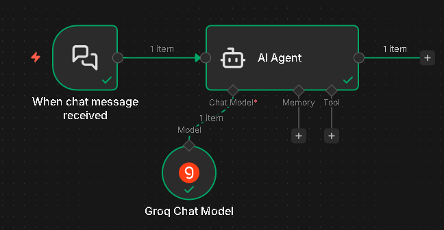

# Single AI Agent Chatbot Workflow Built with n8n

This project implements a **single AI agent chatbot workflow built using n8n**, designed to handle real-time chat messages and generate concise, context-aware responses using a Large Language Model (LLM).

---

## Overview
The workflow demonstrates how n8n can be used not just for automation, but for **agent-based AI orchestration**, where a single autonomous AI agent manages message understanding, reasoning, and response generation.

---

## Workflow Architecture

### n8n Workflow Diagram
This diagram represents the complete single-agent workflow designed in n8n.

---

## Project Objective
The goal of this project is to showcase:
- Single-agent AI workflow design using n8n
- Integration of LLMs into event-driven automation
- Real-time conversational AI using agent-based reasoning
- Clean separation of triggers, agent logic, and language models

---

## Workflow Components

### Trigger
- **Chat Trigger Node**
- Activates when a chat message is received (e.g., messaging platform integration)

### AI Agent
- A **single conversational AI agent** processes the incoming message
- Uses structured instructions to ensure concise, plain-text responses
- Formats output specifically for chat-based platforms

### Language Model
- Integrated LLM (Groq-based chat model)
- Supplies reasoning and natural language understanding to the agent
- Connected directly to the AI Agent node for controlled execution

The entire workflow is handled by **one autonomous AI agent**, without multi-agent decomposition.

---

## AI Agent Responsibilities
The single AI agent performs the following tasks:
- Interprets incoming chat messages
- Applies system-level behavioral instructions
- Generates short, clear, chat-friendly responses
- Ensures output is plain text and non-JSON formatted

This design aligns with real-world chatbot and AI assistant use cases.

---

## Chatbot in Action
Below is an example of the chatbot working in a real chat environment.

---

## Technologies Used
- n8n
- LangChain nodes within n8n
- Large Language Models (Groq)
- JSON-based workflow configuration

---

## Input
- Real-time chat message text received via trigger node

---

## Output
- Plain-text chatbot response
- Concise, formatted message suitable for chat platforms

